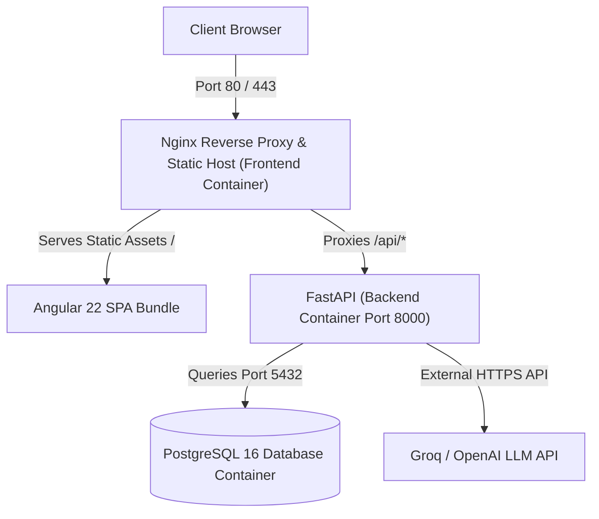

# 🚀 Production Server Deployment Guide

This guide provides end-to-end instructions for deploying the **AI Software Requirement Engineer** full-stack application on any Linux VPS or Cloud Virtual Machine (such as **AWS EC2**, **DigitalOcean Droplet**, **Hetzner**, **Linode**, **Google Cloud Compute Engine**, or **Azure VM**).

---

## 🏗️ Architecture Overview

The production deployment runs via **Docker Compose** with three isolated, interconnected services:



- **Frontend Container**: Nginx Alpine serving the pre-compiled Angular SPA with HTML5 pushState routing, gzip compression, and reverse proxying `/api/` requests to the backend.
- **Backend Container**: Python 3.11-slim running FastAPI with Uvicorn.
- **Database Container**: PostgreSQL 16 Alpine with persistent Docker named volume storage.

---

## 📋 Server Requirements

- **Operating System**: Ubuntu 22.04 LTS / 24.04 LTS or Debian 12 (recommended)
- **Minimum Specs**: 1 vCPU, 2 GB RAM, 20 GB SSD
- **Recommended Specs**: 2 vCPU, 4 GB RAM (ensures faster Angular builds and smooth parallel AI processing)
- **Open Inbound Ports**:
  - `22` (SSH)
  - `80` (HTTP)
  - `443` (HTTPS - if using SSL)
  - `8000` (Optional - only if you want direct external access to Swagger `/docs`)

---

## ⚡ Quick Deployment (Automated)

### 1. Connect to Your Server
```bash
ssh username@YOUR_SERVER_IP
```

### 2. Clone the Repository
```bash
git clone https://github.com/karthikp4561/ai-srs-engineer.git
cd ai-srs-engineer
```

### 3. Create and Edit `.env`
```bash
cp .env.example .env
nano .env
```
Ensure you provide your valid credentials:
- `GROQ_API_KEY`: Your Groq API key (`gsk_...`)
- `POSTGRES_PASSWORD`: A secure database password
- `SECRET_KEY`: A secure 32+ character string for JWT tokens (`openssl rand -hex 32`)
- `ENCRYPTION_KEY`: A Fernet 32-byte key for stored credentials

### 4. Run the Deployment Script
```bash
chmod +x deploy.sh verify.sh
./deploy.sh
```
The script will automatically:
1. Install Docker & Docker Compose if missing.
2. Build and start all 3 containers in background mode.
3. Automatically run health checks to verify everything is operational.

---

## 🛠️ Manual Deployment (Step-by-Step)

If you prefer running commands manually:

### 1. Install Docker & Docker Compose
```bash
curl -fsSL https://get.docker.com -o get-docker.sh
sudo sh get-docker.sh
sudo usermod -aG docker $USER
newgrp docker
```

### 2. Launch the Application
```bash
docker compose up -d --build
```

### 3. Verify Container Status
```bash
docker compose ps
```
You should see all three containers (`srs_postgres`, `srs_backend`, `srs_frontend`) in the `Up` state.

---

## ✅ How to Ensure It Is Running Properly

Run the included verification script:
```bash
./verify.sh
```

### What the Verification Checks:
1. **Container Health**: Verifies that `srs_postgres`, `srs_backend`, and `srs_frontend` are running and healthy.
2. **Database Engine**: Executes `pg_isready` inside the database container.
3. **Backend Health Check**: Calls `http://localhost:8000/db-check` to verify that FastAPI connects and executes SQL queries.
4. **Angular SPA**: Requests `http://localhost/` to ensure Nginx serves the compiled application with HTTP 200.
5. **Reverse Proxy & Routing**: Calls `http://localhost/api/db-check` through Nginx on port 80 to ensure the reverse proxy successfully reaches the backend without CORS issues.

### Manual Verification via Curl:
```bash
# 1. Test database connection via backend
curl http://localhost:8000/db-check

# 2. Test frontend proxy to backend
curl http://localhost/api/db-check

# 3. Test frontend root
curl -I http://localhost/
```

### Browser Verification:
- **Frontend App**: Open `http://YOUR_SERVER_IP` in your browser. You should see the login/register screen.
- **Interactive Swagger Docs**: Open `http://YOUR_SERVER_IP:8000/docs` or `http://YOUR_SERVER_IP/docs`.

---

## 🔒 Adding a Domain Name & Free SSL (Let's Encrypt)

To serve your project securely over `https://yourdomain.com`:

1. **Point your domain DNS**: Add an `A` record pointing `yourdomain.com` and `www.yourdomain.com` to your server's public IP address.
2. **Install Certbot**:
   ```bash
   sudo apt-get install -y certbot python3-certbot-nginx
   ```
3. Alternatively, you can run Certbot or Nginx Proxy Manager as a Docker container to automatically renew Let's Encrypt certificates.

---

## 🔄 Useful Operations & Maintenance

### View Live Container Logs
```bash
# All logs
docker compose logs -f

# Backend logs only
docker compose logs -f backend

# Frontend/Nginx logs only
docker compose logs -f frontend

# Database logs only
docker compose logs -f db
```

### Restarting the Application
```bash
docker compose restart
```

### Updating to the Latest Code
```bash
git pull origin main
docker compose up -d --build
./verify.sh
```

### Database Backup & Restore
```bash
# Create a backup
docker compose exec -T db pg_dump -U postgres ai_srs_engineer > backup_$(date +%Y%m%d).sql

# Restore from a backup
cat backup_file.sql | docker compose exec -T db psql -U postgres -d ai_srs_engineer
```

### Stopping the Services
```bash
docker compose down
```
*(Your PostgreSQL data remains safe inside the Docker volume `postgres_data`.)*
